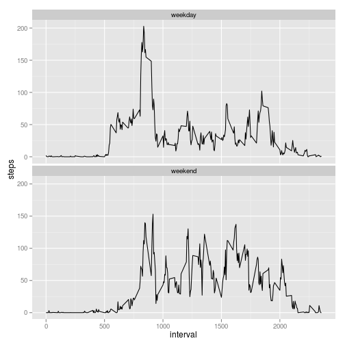

---
title: "Reproducible Research: Peer Assessment 1"
output: 
  html_document:
    keep_md: true
---

  
## Loading and preprocessing the data

1. Loading the dataset. Assume that work directory is set to the location of the data file:

```r
dataset = read.csv("activity.csv")
str(dataset)
```

```
## 'data.frame':	17568 obs. of  3 variables:
##  $ steps   : int  NA NA NA NA NA NA NA NA NA NA ...
##  $ date    : Factor w/ 61 levels "2012-10-01","2012-10-02",..: 1 1 1 1 1 1 1 1 1 1 ...
##  $ interval: int  0 5 10 15 20 25 30 35 40 45 ...
```

2. Data processing and transformation:
- not needed at this point

## What is mean total number of steps taken per day?

1. Histogram of total number of steps taken each day:

```r
total_steps_per_day = tapply(dataset$steps, dataset$date, FUN=sum)
hist(total_steps_per_day, main="Histogram of total number of steps each day", xlab="total steps per day")
```

 

2. Calculation of the mean and median total number of steps taken per day:

The mean number of steps taken per day is:

```r
mean(total_steps_per_day, na.rm=TRUE)
```

```
## [1] 10766
```

The median number of steps taken per day is:

```r
median(total_steps_per_day, na.rm=TRUE)
```

```
## [1] 10765
```

  
  
## What is the average daily activity pattern?
1. Time series plot of average number of steps per interval, averaged across all days:

```r
step_by_interval = aggregate(steps ~ interval, data=dataset, FUN=mean, na.rm=TRUE)
plot(step_by_interval$interval, step_by_interval$steps, type="l", xlab="interval", ylab="average steps")
```

 

2. Reporting the time interval that contains the maximum number of steps:

```r
step_by_interval$interval[step_by_interval$steps==max(step_by_interval$steps)]
```

```
## [1] 835
```


## Imputing missing values

1. The total number of missing values in the dataset (i.e. the total number of rows with NA)

```r
nrow(dataset[!complete.cases(dataset),])
```

```
## [1] 2304
```

2. Imputation strategy for missing step data:
- A missing step value is imputed by the mean number of steps of the same day
- If a day has exclusively missing step values throughout all intervals, then the imputed value is 0.

3. Creating a new dataset with imputed data:

```r
mean_by_day = tapply(dataset$steps, dataset$date, FUN=mean, na.rm=TRUE)
mean_by_day[is.na(mean_by_day)]=0
dataset_imputed = dataset
dataset_imputed$steps[is.na(dataset$steps)]=mean_by_day[dataset$date[is.na(dataset$steps)]]
str(dataset_imputed)
```

```
## 'data.frame':	17568 obs. of  3 variables:
##  $ steps   : num  0 0 0 0 0 0 0 0 0 0 ...
##  $ date    : Factor w/ 61 levels "2012-10-01","2012-10-02",..: 1 1 1 1 1 1 1 1 1 1 ...
##  $ interval: int  0 5 10 15 20 25 30 35 40 45 ...
```

4. Histogram of total steps and mean/median statistics of imputed dataset

```r
total_steps_per_day_imputed = tapply(dataset_imputed$steps, dataset_imputed$date, FUN=sum)
hist(total_steps_per_day_imputed, main="Histogram of total number of steps per day [imputed dataset]", xlab="total steps per day")
```

 


For the imputed dataset the mean number of steps taken per day is:

```r
mean(total_steps_per_day_imputed, na.rm=TRUE)
```

```
## [1] 9354
```

For the imputed dataset the median number of steps taken per day is:

```r
median(total_steps_per_day_imputed, na.rm=TRUE)
```

```
## [1] 10395
```

The values for the mean and median of the total steps per day in the imputed dataset are lower than for the unimputed dataset. This is mainly due to the imputation by a lot of zero values which is the result of imputing values from a day full of missing step data with the value 0. The histogram also shows a bias on the low (zero) bar. Certainly this imputation strategy can be refined further.

## Are there differences in activity patterns between weekdays and weekends?

1. Creating a new factor variable to distinguish between "weekday" and "weekend":

```r
dataset_imputed$weekday = weekdays(as.Date(dataset$date))
dataset_imputed$day.category[dataset_imputed$weekday %in% c("Monday","Tuesday","Wednesday","Thursday","Friday")] = "weekday"
dataset_imputed$day.category[dataset_imputed$weekday %in% c("Saturday","Sunday")] = "weekend"
dataset_imputed$day.category = factor(dataset_imputed$day.category)
str(dataset_imputed)
```

```
## 'data.frame':	17568 obs. of  5 variables:
##  $ steps       : num  0 0 0 0 0 0 0 0 0 0 ...
##  $ date        : Factor w/ 61 levels "2012-10-01","2012-10-02",..: 1 1 1 1 1 1 1 1 1 1 ...
##  $ interval    : int  0 5 10 15 20 25 30 35 40 45 ...
##  $ weekday     : chr  "Monday" "Monday" "Monday" "Monday" ...
##  $ day.category: Factor w/ 2 levels "weekday","weekend": 1 1 1 1 1 1 1 1 1 1 ...
```

2. Panel plot to compare weekend and weekday activity

```r
step_by_interval_imputed = aggregate(steps ~ interval+day.category, data=dataset_imputed, FUN=mean, na.rm=TRUE)
library(ggplot2)
g = ggplot(step_by_interval_imputed, aes(interval, steps))
g + geom_line() + facet_wrap(~ day.category, nrow=2, ncol=1)
```

 


